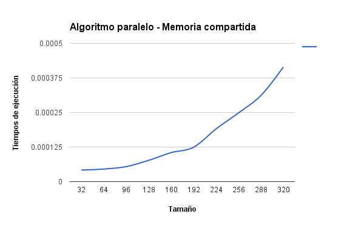

####HPC
#Taller 2 - Parcial 1
##Multiplicación de Matrices

Se realizó la multiplicación de 2 matrices cuadradas con 3 algoritmos diferentes. En el primer algoritmo se realizó la multiplicación de las matrices de manera secuencial. En el segundo algoritmo se realizó la multiplicación de manera paralela usando Cuda, esta solución fue la ingenua. En el tercer algoritmo se realizó la multiplicación de manera paralela con Cuda y usando memoria compartida.

Se realizó una toma de datos con 10 tamaños diferentes para las matrices, por cada tamaño se ejecuto 15 veces; Estos datos se ingresaron en unas tablas las cuales contienen los siguientes campos: Tamaño de la matriz, Ts (Tiempo de ejecución del algoritmo secuencial), Tp (Tiempo de ejecución del algoritmo paralelo - Ingenuo o con memoria compartida), X = Ts/Tp (Aceleración), despues de tomar los tiempos de ejecución por cada tamaño se sacó el promedio de los tiempos de ejecución y por ultimo se calculo la aceleración.

##**Algoritmo Secuencial**

**Tabla tiempos de ejecución**: Contiene el promedio de los tiempos de ejecución por cada tamaño.

Tamaño | Ts
-------|----
10|	0.0000084
50|	0.0006984666667
100|	0.0061326
150|	0.0161986
200|	0.03334733333
250|	0.05958433333
300|	0.100531
350|	0.1579652
400|	0.2362216
450|	0.3485031333

##**Algoritmo Paralelo**

**Tabla tiempos de ejecución**: Contiene el promedio de los tiempos de ejecución por cada tamaño.

Tamaño | Ts
-------|----
10|	0.00003693333333
50|	0.00005133333333
100|	0.00008113333333
150	|0.0001438
200|	0.0002484666667
250|	0.0004378666667
300|	0.0006682666667
350|	0.001048933333
400|	0.001341
450|	0.002127066667

##**Algoritmo Paralelo Memoria compartida**

**Tabla tiempos de ejecución**: Contiene el promedio de los tiempos de ejecución por cada tamaño.

Tamaño | Ts
-------|----
32|	0.000042
64|	0.00004546666667
96|	0.00005426666667
128|	0.00007693333333
160|	0.0001048666667
192|	0.000124
224|	0.0001904666667
256|	0.0002482666667
288|	0.0003111333333
320|	0.0004144

##**Algoritmo secuencial Vs Algoritmo paralelo (ingenuo)**
Se realizó una comparación entre el algortimo secuencial y el algoritmo paralelo ingenuo mediante la toma de datos de los tiempos de ejecución con diferentes tamaños para cada algoritmo, se saco una gráfica de aceleración con los datos obtenidos.

La implementación del algoritmo paralelo se hizo con Cuda.

El archivo con el algoritmo es : **multi_matrices_ingenuo.c**

**Tabla tiempos de ejecución**: Contiene el promedio de los tiempos de ejecución de Ts, Tp y de X por cada tamaño.

Las tablas completas con los datos correspondientes para cada tamaño se encuentran en el archivo **Tablas - Ts Vs Tp ingenuo.md**

Tamaño | Ts | Tp | X = Ts/Tp
-------|----|----|-----------
10|	0.0000084|0.00003693333333|0.2274368231
50|	0.0006984666667|0.00005133333333|13.60649351
100|	0.0061326|0.00008113333333|75.58668858
150	|0.0161986|0.0001438|112.6467316
200|	0.03334733333|0.0002484666667|134.2125034
250|	0.05958433333|0.0004378666667|136.078715
300|	0.100531|0.0006682666667|150.4354549
350|	0.1579652|0.001048933333|150.5960341
400|	0.2362216|0.001341|176.1533184
450|	0.3485031333|0.002127066667|163.84213

####Gráfica

##**Algoritmo secuencial Vs Algoritmo paralelo (Tiling)**

Se comparó la ejecución entre el algoritmo secuencial y el algoritmo paralelo con memoria compartida mediante la toma de datos de los tiempos de ejecución con diferentes tamaños para cada algoritmo, se saco una gráfica de aceleración con los datos obtenidos.

El archivo con el algoritmo es : **multi_matrices_tiling.c**

**Tabla tiempos de ejecución**: Contiene el promedio de los tiempos de ejecución de Ts, Tp y de X por cada tamaño.

Las tablas completas con los datos correspondientes para cada tamaño se encuentran en el archivo **Tablas - Ts Vs Tp Tiling.md**

Tamaño | Ts | Tp | X = Ts/Tp
-------|----|----|-----------
32|0.0001564666667 |	0.000042|3.725396825
64|0.001239266667 |	0.00004546666667|27.25659824
96|0.006012133333 |	0.00005426666667|110.7886978
128| 0.01132366667|	0.00007693333333|147.1880416
160|0.02060126667 |	0.0001048666667|196.4520025
192|0.0330388 |	0.000124|266.4419355
224|0.04628146667 |	0.0001904666667|242.9898495
256|0.07255753333 |	0.0002482666667|292.2564447
288|0.1026912667 |	0.0003111333333|292.2564447
320|0.1408583333 |	0.0004144|339.9091055

####Gráfica

##**Conclusiones**

1. Se observó que el algoritmo secuencial es menos óptimo que los algoritmos paralelos.
2. El algoritmo paralelo que usa memoria compartida es mas óptimo que el algoritmo ingenuo ya que divide su trabajo y acaba en un menor tiempo.
3. La aceleración en la implementación con memoria compartida es incremental, siempre sube.
4. La aceleración en la implementación ingenua llega a un punto en que parece que trata nivelarse, no es incremental como la aceleración en la ejecución ingenua.
