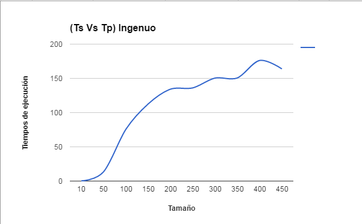
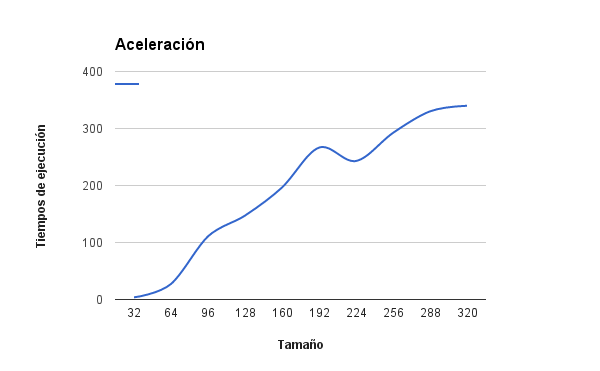

###HPC
#Taller 2
###Multiplicación de Matrices

En este taller se escribió un codigo para la multiplicación de matrices de manera secuencial y otro de manera paralela. Se realizó una toma de datos con diferentes tamaños para las matrices, por cada tamaño se ejecuto 5 veces y se tomó el tiempo que se demoraba cada ejecución (Ts y Tp), luego se sacó el valor de Ts/Tp, por ultimo se sacó el promedio de Ts/Tp y se realizo la gráfica para ver el comportamiento de la ejecución.

####**Algoritmo secuencial Vs Algoritmo paralelo (ingenuo)**

####**Algoritmo secuencial Vs Algoritmo paralelo (Tiling)**

####**Conclusiones**
