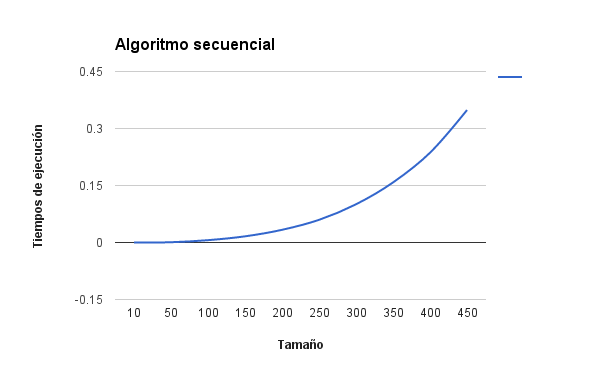
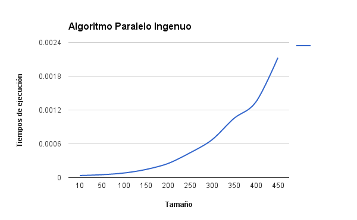

####HPC
#Taller 2 - Parcial 1
##Multiplicación de Matrices

Se realizó la multiplicación de 2 matrices cuadradas con 3 algoritmos diferentes. En el primer algoritmo se realizó la multiplicación de las matrices de manera secuencial. En el segundo algoritmo se realizó la multiplicación de manera paralela usando Cuda, esta solución fue la ingenua. En el tercer algoritmo se realizó la multiplicación de manera paralela con Cuda y usando memoria compartida.

Se realizó una toma de datos con 10 tamaños diferentes para las matrices, por cada tamaño se ejecuto 15 veces; Estos datos se ingresaron en unas tablas las cuales contienen los siguientes campos: Tamaño de la matriz, Ts (Tiempo de ejecución del algoritmo secuencial), Tp (Tiempo de ejecución del algoritmo paralelo - Ingenuo o con memoria compartida), X = Ts/Tp (Aceleración), despues de tomar los tiempos de ejecución por cada tamaño se sacó el promedio de los tiempos de ejecución y por ultimo se calculo la aceleración.

####**Algoritmo Secuencial**

**Tabla tiempos de ejecución**: Contiene el promedio de los tiempos de ejecución por cada ta

Tamaño | Ts
-------|----
10|	0.0000084
50|	0.0006984666667
100|	0.0061326
150|	0.0161986
200|	0.03334733333
250|	0.05958433333
300|	0.100531
350|	0.1579652
400|	0.2362216
450|	0.3485031333

####**Algoritmo Paralelo**

**Tabla tiempos de ejecución**: Contiene el promedio de los tiempos de ejecución por cada tamaño

Tamaño | Ts
-------|----
10|	0.00003693333333
50|	0.00005133333333
100|	0.00008113333333
150	|0.0001438
200|	0.0002484666667
250|	0.0004378666667
300|	0.0006682666667
350|	0.001048933333
400|	0.001341
450|	0.002127066667

####**Algoritmo Paralelo Memoria compartida**

####**Algoritmo secuencial Vs Algoritmo paralelo (ingenuo)**

####**Algoritmo secuencial Vs Algoritmo paralelo (Tiling)**

####**Conclusiones**
